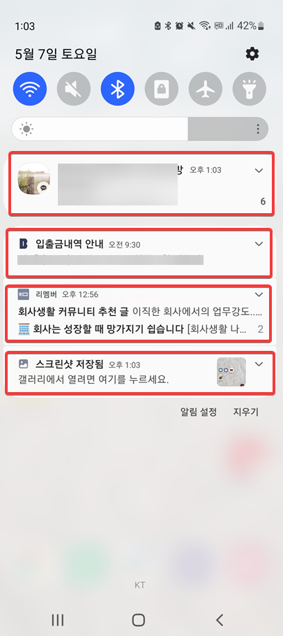

# Payment Details Notification Listener Service Example

## 알림(Notification)이란?
https://developer.android.com/guide/topics/ui/notifiers/notifications.html
- 알림은 안드로이드가 앱UI의 외부에 표시하여 사용자에게 알림 등을 제공하는 메시지다.
- 사용자는 알림을 눌러 앱을 열거나 알림에서 직접 액션을 수행할 수 있다.

<b>실제로 핸드폰에서 보이는 알림 예시</b> 

  

## 다른 앱의 알림(Notification) 받을 받아오는 방법

안드로이드폰에서 여러 앱의 알림을 받아오기 위해서는 앱의 백그라운드에서 계속해서 돌아가는 서비스(Service)가 필요하다. 다행히도 알림 수신만을 위한 서비스가 있는데 바로 <b>NotificationListenerService</b> 이다 . 

이 서비스를 사용하면, 1) 알림이 새로 추가되거나, 2) 기존 알림이 제거되거나, 3) 알림의 순위가 바뀔 때 특정한 동작을 수행하도록 할 수 있다. 

## 프로젝트 개요

### 개발 동기
- 언제 어디서 얼마를 쓰는지 자동으로 데이터를 수집하고 싶었음. 즉 실시간 자동 연동 가계부 같은 앱이 필요했다.
- 이미 존재하는 가계부 앱도 있고, 문자나 알림과 연동해서 데이터를 수집하는 기능이 있는 앱도 있음
  - 그 앱에서 수집하는 데이터에 자유롭게 접근하기 힘들었다.
  - 앱의 데이터를 테이블 형태의 데이터로 가져오려면 추가적인 변환작업이 필요함
-  내 핸드폰에서 발생하는 데이터는 구글 시트에 나만의 방식으로 수집 및 관리를 하고 싶어서 앱을 개발하게 되었음

### 앱의 주요 기능
- 카카오뱅크 / 삼성페이 알림 데이터 실시간 수집
  - 삼성페이 : 소비 데이터 수집
(현재 실물카드를 거의 사용하지 않으며 대부분(99%)의 결제를 삼성페이로 진행하고 있음)
  - 카카오뱅크 알림을 통해 소득(월급) 데이터 수집 
- 수집된 알림 데이터는 실시간으로 구글 시트에 기록
- 처음 앱을 설치한 후에는 앱이 꺼져있어도 데이터 자동 수집

